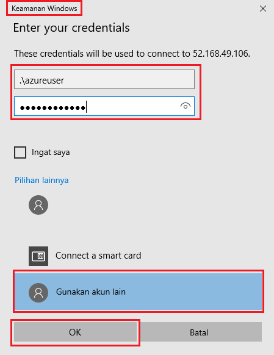

---
wts:
    title: '01 - Membuat komputer virtual di portal (10 menit)'
    module: 'Modul 02 – Core Azure Services (Beban Kerja)'
---
# 01 - Membuat komputer virtual di portal

Dalam panduan ini, kita akan membuat komputer virtual di portal Microsoft Azure, menyambungkan ke komputer virtual, menginstal peran server web dan mengujinya. 

**Catatan**: Luangkan waktu selama panduan ini untuk mengeklik dan membaca ikon Informasi. 

# Tugas 1: Membuat komputer virtual (10 menit)

Dalam tugas ini, kita akan membuat Pusat Data Windows Server 2019 - komputer virtual Gen1. 

1. Masuk ke [portal Azure (https://portal.azure.com)](https://portal.azure.com?azure-portal=true).

2. Dari bilah **All services**, cari dan pilih **Virtual machine**, lalu klik **+ Add** dan pilih **+Virtual machine**.

3. Pada tab **Basics**, isi informasi berikut (biarkan default untuk yang lainnya):

    | Settings | Values |
    |  -- | -- |
    | Subscription | **Pilih langganan Anda**|
    | Resource group | **myRGVM** (buat baru) |
    | Virtual machine name | **myVm** |
    | Location | **(US) East US**|
    | Image | **Windows Server 2019 Datacenter - Gen1**|
    | Size | Standard D2s v3|
    | Administrator account username | **azureuser** |
    | Administrator account password | **Pa$$w0rd1234**|
    | Inbound port rules - Allow select ports | **RDP (3389)** dan **HTTP (80)**|
    | | |

4. Beralih ke tab Networking, dan cari **Select inbound ports**:

    | Settings | Values |
    | -- | -- |
    | Select inbound ports | **HTTP (80), RDP (3389)**|
    | | |

    **Catatan** - Pastikan port 80 dan 3389 dipilih

5. Beralih ke tab Management, dan di bagian **Monitoring**, pilih pengaturan berikut:

    | Settings | Values |
    | -- | -- |
    | Boot diagnostics | **Disable**|
    | | |

6. Biarkan default yang tersisa lalu klik tombol **Review + create** di bagian bawah halaman.

7. Setelah melewati proses Validasi, klik tombol **Create**. Diperlukan waktu lima hingga tujuh menit untuk menyebarkan komputer virtual.

8. Anda akan menerima pembaruan di halaman penyebaran dan melalui area **Notifications** (ikon bel di menu atas).

* **Pastikan bahwa Port 80 dan 3389 telah dibuka**

# Tugas 2: Menyambungkan ke komputer virtual

Dalam tugas ini, kita akan terhubung ke komputer virtual baru menggunakan RDP. 

1. Cari **myVM** dan pilih komputer virtual baru.

    **Catatan**: Anda juga dapat menggunakan tautan **Go to resource** di halaman penyebaran atau tautan ke sumber daya di area **Notifications**.

2. Pada bilah **Overview** komputer virtual, klik tombol **Connect** dan pilih **RDP**.

    

    **Catatan**: Petunjuk berikut memberi tahu Anda cara menyambungkan ke komputer virtual dari komputer Windows. Di Mac, Anda memerlukan klien RDP seperti  Remote Desktop Client ini dari Mac App Store dan di komputer Linux, Anda dapat menggunakan klien RDP sumber terbuka.

2. Di halaman **Connect to virtual machine**, pertahankan opsi default untuk tersambung dengan alamat IP publik melalui port 3389 dan klik **Download RDP File**.

3. **Buka** file RDP yang diunduh dan klik **Connect** saat diminta. 

    

4. Di jendela **Windows Security**, pilih **More choices** lalu **Use adifferent account**. Berikan nama pengguna (.\azureuser) dan kata sandi (Pa$$w0rd1234). Klik **OK** untuk menyambungkan.

    

5. Anda mungkin menerima peringatan sertifikat selama proses masuk. Klik **Yes** atau untuk membuat koneksi dan menyambungkan ke komputer virtual yang Anda sebarkan. Anda akan berhasil tersambung.

    

Selamat! Anda telah menyebarkan dan tersambung ke komputer virtual Windows Server di Azure

# Tugas 3: Menginstal peran server web dan mengujinya

Dalam tugas ini, instal peran Web Server di server dan pastikan halaman selamat datang IIS default dapat ditampilkan.

1. Buka perintah PowerShell di komputer virtual, dengan mengklik tombol **Start**, mengetikkan **PowerShell**, mengklik kanan **Windows PowerShell**, dan memilih **Run as administrator** di menu klik kanan.

    

2. Instal fitur **Web-Server** di komputer virtual dengan menjalankan perintah berikut di perintah PowerShell. Anda dapat menyalin dan menempelkan perintah ini.

    ```PowerShell
    Install-WindowsFeature -name Web-Server -IncludeManagementTools
    ```
  
3. Setelah selesai akan ada baris yang menyatakan **Success** dengan nilai **True**. Anda tidak perlu menghidupkan ulang komputer virtual untuk menyelesaikan penginstalan. Tutup koneksi RDP ke komputer virtual.

    

4. Kembali ke portal, navigasikan kembali ke bilah **Overview** myVM dan gunakan tombol **Click to clipboard** untuk menyalin alamat IP publik myVM, buka tab browser baru, tempelkan alamat IP publik ke dalam kotak teks URL, dan tekan tombol **Enter** untuk menjelajahinya.

    

5. Halaman selamat datang IIS Web Server default akan terbuka.

    

Selamat! Anda telah membuat server web yang dapat diakses melalui alamat IP publiknya. Jika Anda memiliki aplikasi web untuk dibuat menjadi host, Anda dapat menyebarkan file aplikasi ke komputer virtual dan menjadikannya host untuk akses publik di komputer virtual yang disebarkan.


**Catatan**: Untuk menghindari biaya tambahan, Anda dapat menghapus grup sumber daya ini. Telusuri grup sumber daya, klik grup sumber daya, lalu klik **Delete resource group**. Pastikan nama grup sumber daya lalu klik **Delete**. Pantau **Notifications** untuk melihat verifikasi bahwa penghapusan berhasil diselesaikan. 
