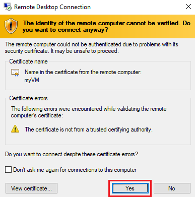
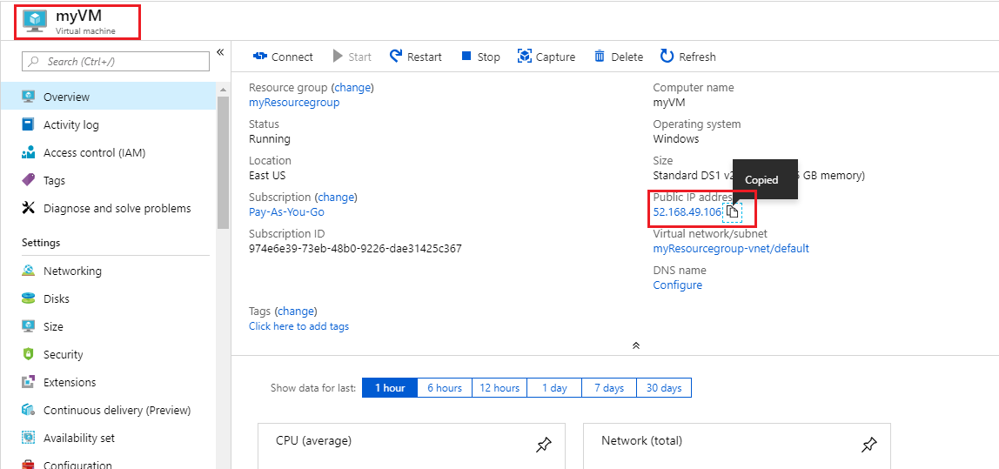

---
wts:
    title: '01 - Membuat komputer virtual di portal (10 menit)'
    module: 'Modul 02 – Core Azure Services (Beban Kerja)'
---
# 01 - Membuat komputer virtual di portal (10 menit)

Dalam panduan ini, kita akan membuat komputer virtual di portal Microsoft Azure, menyambungkan ke komputer virtual, menginstal peran server web dan mengujinya. 

**Catatan**: Luangkan waktu selama panduan ini untuk mengeklik dan membaca ikon Informasi. 

# Tugas 1: Membuat komputer virtual 
1. Masuk ke portal Azure: **https://portal.azure.com**

3. Dari bilah **All services** di Menu Portal, cari dan pilih **Virtual machines**, lalu klik **+Add, +Create, +New** dan pilih **+Virtual machine** dari menu tarik turun.

4. Pada tab **Basics**, isi informasi berikut (biarkan default untuk yang lainnya):

    | Settings | Values |
    |  -- | -- |
    | Subscription | **Gunakan default yang ada** |
    | Resource group | **Buat nama grup sumber daya baru** |
    | Virtual machine name | **myVM** |
    | Region | **(US) East US**|
    | Availability options | Tidak perlu opsi redundansi infrastruktur|
    | Image | **Windows Server 2019 Datacenter - Gen2**|
    | Size | **Standard D2s v3**|
    | Administrator account username | **azureuser** |
    | Administrator account password (ketikkan dengan hati-hati!) | **Pa$$w0rd1234**|
    | Inbound port rules | **Allow select ports**|
    | Select inbound ports | **RDP (3389)** dan **HTTP (80)**| 

5. Beralihlah ke tab Jaringan untuk memastikan **HTTP (80) dan RDP (3389)** dipilih di bagian **Select inbound ports**.

6. Beralih ke tab Management, dan di bagian **Monitoring**, pilih pengaturan berikut:

    | Settings | Values |
    | -- | -- |
    | Boot diagnostics | **Disable**|

7. Biarkan nilai yang tersisa pada default, lalu klik tombol **Review + create** di bagian bawah halaman.

8. Setelah melewati proses Validasi, klik tombol **Create**. Diperlukan waktu lima hingga tujuh menit untuk menyebarkan komputer virtual.

9. Anda akan menerima pembaruan di halaman penyebaran dan melalui area **Notifications** (ikon bel di bilah menu atas).

# Tugas 2: Menyambungkan ke komputer virtual

Dalam tugas ini, kita akan terhubung ke komputer virtual baru menggunakan RDP (Remote Desktop Protocol). 

1. Klik ikon lonceng dari bilah alat biru di atas, dan pilih ‘Go to resource’ saat penyebaran Anda telah berhasil. 

    **Catatan**: Anda juga dapat menggunakan tautan **Go to resource** di halaman penyebaran 

2. Di bilah **Overview** komputer virtual, klik tombol **Connect** dan pilih **RDP** dari menu tarik turun.

    

    **Catatan**: Petunjuk berikut memberi tahu Anda cara menyambungkan ke komputer virtual dari komputer Windows. Di Mac, Anda memerlukan klien RDP seperti  Remote Desktop Client ini dari Mac App Store dan di komputer Linux, Anda dapat menggunakan klien RDP sumber terbuka.

2. Di halaman **Connect to virtual machine**, biarkan opsi default untuk tersambung dengan alamat IP publik melalui port 3389 dan klik **Download RDP File**. File akan diunduh di sebelah kiri bawah layar.

3. **Buka** file RDP yang diunduh (ada di sebelah kiri bawah komputer lab) dan klik **Connect** bila diminta. 

    

4. Di jendela **Windows Security**, masuk menggunakan Kredensial Admin yang Anda gunakan saat membuat VM **azureuser** dan kata sandi **Pa$$w0rd1234**. 

5. Anda mungkin menerima peringatan sertifikat selama proses masuk. Klik **Yes** atau untuk membuat koneksi dan menyambungkan ke komputer virtual yang Anda sebarkan. Anda akan berhasil tersambung.

    

Komputer Virtual baru (myVM) akan diluncurkan di dalam Lab Anda. Tutup Pengelola Server dan jendela dasbor yang muncul (klik “x” di bagian kanan atas). Anda akan melihat latar belakang biru dari komputer virtual Anda. **Selamat!** Anda telah menyebarkan dan menghubungkan Komputer Virtual yang menjalankan Windows Server. 

# Tugas 3: Menginstal peran server web dan mengujinya

Dalam tugas ini, instal peran Web Server di server di Komputer Virtual yang baru Anda buat dan pastikan halaman selamat datang IIS default dapat ditampilkan. 

1. Di komputer virtual yang baru dibuka, luncurkan PowerShell dengan mencari **PowerShell** di bilah pencarian. Saat ditemukan, klik **Windows PowerShell**, lalu **Run as administrator**.

    

2. Di PowerShell, instal fitur **Web-Server** di komputer virtual dengan menjalankan perintah berikut. (Tempelkan pada baris perintah dan tekan ENTER agar instalasi dimulai).

    ```PowerShell
    Install-WindowsFeature -name Web-Server -IncludeManagementTools
    ```
  
3. Setelah selesai, ada baris yang menyatakan **Success** dengan nilai **True**. Anda tidak perlu menghidupkan ulang komputer virtual untuk menyelesaikan penginstalan. Tutup koneksi RDP ke VM dengan mengklik **x** di bilah biru di bagian tengah atas komputer virtual Anda. Anda juga dapat meminimalisasinya dengan mengklik **-** di bilah biru di bagian tengah atas.

    

4. Kembali ke portal, navigasikan kembali ke bilah **Overview** dari myVM dan gunakan tombol **Click to clipboard** untuk menyalin alamat IP publik myVM, lalu buka tab browser baru, tempelkan alamat IP publik ke kotak teks URL, dan tekan tombol **Enter** untuk menjelajahinya.

    

5. Halaman selamat datang IIS Web Server default akan ditampilkan.

    

**Selamat!** Anda telah membuat VM baru yang menjalankan server web yang dapat diakses melalui alamat IP publiknya. Jika Anda memiliki aplikasi web untuk dibuat menjadi host, Anda dapat menyebarkan file aplikasi ke komputer virtual dan menjadikannya host untuk akses publik di komputer virtual yang disebarkan.


**Catatan**: Untuk menghindari biaya tambahan, Anda dapat secara opsional menghapus grup sumber daya ini. Telusuri grup sumber daya, klik grup sumber daya, lalu klik **Delete resource group**. Verifikasi nama grup sumber daya, lalu klik **Delete**. Pantau **Notifications** untuk melihat bagaimana proses penghapusan.
