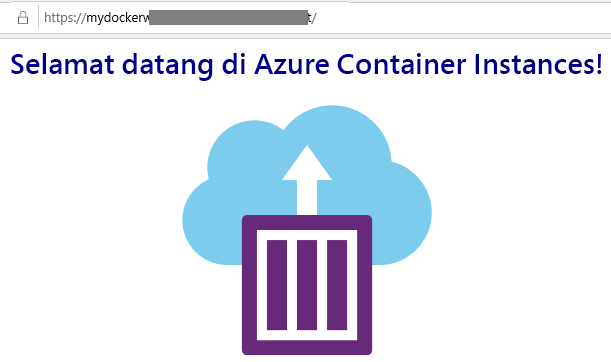

---
wts:
    title: '02 - Membuat Aplikasi Web (10 menit)'
    module: 'Modul 02 – Core Azure Services (Beban Kerja)'
---
# 02 - Membuat Aplikasi Web (10 menit)

Dalam panduan ini, kita akan membuat aplikasi web yang menjalankan kontainer Docker. Kontainer Docker menampilkan pesan Selamat Datang. 

Azure App Service sebenarnya adalah kumpulan dari empat layanan, yang semuanya dibuat untuk membantu Anda membuat host  dan menjalankan aplikasi web. Keempat layanan (Web Apps, Mobile Apps, API Apps, dan Logic Apps) terlihat berbeda, tetapi pada akhirnya semuanya beroperasi dengan cara yang sangat mirip. Web Apps adalah yang paling umum digunakan dari empat layanan, dan ini adalah layanan yang akan kita gunakan di lab ini.

# Tugas 1: Menciptakan Aplikasi Web 

Dalam tugas ini, Anda akan membuat Aplikasi Web Azure App Service. 

1. Masuk ke [portal Microsoft Azure](http://portal.azure.com/). 

2. Dari bilah **All service**, cari dan pilih **App Services**, lalu klik **+ Add, + Create, + New**

3. Pada tab **Basics** dari bilah **Web App**, tentukan pengaturan berikut (ganti **xxxx** dengan nama aplikasi web dengan huruf dan angka sehingga namanya unik secara global). Biarkan default untuk yang lainnya, termasuk App Service Plan. 

    | Setting | Value |
    | -- | -- |
    | Subscription | **Gunakan default yang ada** |
    | Resource Group | **Buat nama grup sumber daya baru**|
    | Name | **myDockerWebAppxxxx** |
    | Publish | **Docker Container** |
    | Operating System | **Linux** |
    | Region | **East US** |
    
    **Catatan:** Ingatlah untuk mengganti **xxxx** agar nama Aplikasi Web Anda menjadi unik.

4. Klik **Next > Docker** dan konfigurasikan informasi kontainer.  

    | Setting | Value |
    | -- | -- |
    | Options | **Single container** |
    | Image Source | **Docker Hub** |
    | Access Type | **Public** |
    | Image and tag | **mcr.microsoft.com/azuredocs/aci-helloworld** |
    
 **Catatan:** Perintah mulai adalah opsional dan tidak diperlukan dalam latihan ini.

5. Klik **Review + create**, lalu klk **Create**. 

# Tugas 2: Menguji Aplikasi Web

Dalam tugas ini, kita akan menguji aplikasi web.

1. Tunggu hingga Aplikasi Web disebarkan

2. Dari **Notifications**, klik **Go to resource**. 

3. Di bilah **Overview**, temukan **URL**. Salin URL ke papan klip.

    

4. Di jendela browser baru, tempelkan URL dan tekan enter. Pesan sambutan Selamat Datang ke Azure Container Instances! akan ditampilkan.

    

5. Beralih kembali ke bilah **Overview** aplikasi web dan gulir ke bawah. Anda akan melihat beberapa bagan pelacakan Data Masuk/Keluar dan Permintaan. Jika mengulangi langkah 4 beberapa kali, Anda akan melihat telemetri yang sesuai ditampilkan di bagan ini. Ini termasuk jumlah permintaan dan waktu respons rata-rata. 

**Catatan**: Untuk menghindari biaya tambahan, Anda dapat secara opsional menghapus grup sumber daya ini. Telusuri grup sumber daya, klik grup sumber daya, lalu klik **Delete resource group**. Verifikasi nama grup sumber daya, lalu klik **Delete**. Pantau **Notifications** untuk melihat bagaimana proses penghapusan.

Selamat, Anda telah berhasil membuat Azure App Service.
