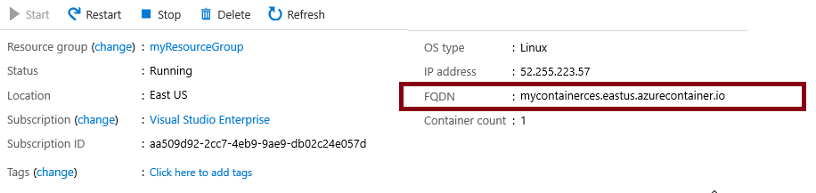
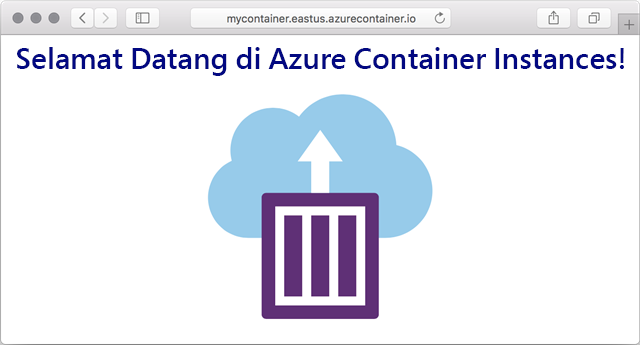

---
wts:
    title: '03 - Menyebarkan Azure Container Instances (10 menit)'
    module: 'Modul 02 – Core Azure Services (Beban Kerja)'
---

# 03 - Menyebarkan Azure Container Instances (10 menit)

Dalam panduan ini kita membuat, mengonfigurasi, dan menyebarkan kontainer menggunakan Azure Container Instances (ACI) di Portal Microsoft Azure. Kontainer adalah aplikasi web Selamat Datang di ACI yang menampilkan halaman HTML statis. 

# Tugas 1: Membuat instans kontainer 

Dalam tugas ini, kita akan membuat instans kontainer baru untuk aplikasi web. 

1. Masuk ke [portal Microsoft Azure](https://portal.azure.com).

2. Dari bilah **All services**, cari dan pilih **Container instances**, lalu klik **+ Add, + Create, + New**. 

3. Berikan detail Dasar berikut untuk instans kontainer baru (biarkan default untuk yang lainnya)): 

	| Setting| Value|
	|----|----|
	| Subscription | ***Gunakan default yang ada*** |
	| Resource group | **Buat nama grup sumber daya baru** |
	| Container name| **mycontainer**|
	| Region | **(US) East US** |
	| Image source| **Docker Hub or other registry**|
	| Image type| **Public**|
	| Image| **mcr.microsoft.com/azuredocs/aci-helloworld**|
	| OS type| **Linux** |
	| Size| ***Leave at the default***|

4. Konfigurasikan tab Jaringan (ganti **xxxx** dengan huruf dan angka sehingga namanya unik secara global). Biarkan semua pengaturan lain pada nilai default.

	| Setting| Value|
	|--|--|
	| DNS name label| **mycontainerdnsxxxxx** |

	
	**Catatan**: Kontainer Anda akan dapat dijangkau publik di dns-name-label.region.azurecontainer.io. Jika Anda menerima pesan kesalahan **DNS name label not available** setelah penyebaran, tentukan label nama DNS yang berbeda (ganti xxxx) dan sebarkan kembali. 

5. Klik **Review and Create** untuk memulai proses validasi otomatis.

6. Klik **Create** untuk membuat instans kontainer. 

7. Pantau halaman penyebaran dan **Notifications**. 

# Tugas 2: Memverifikasi penyebaran innstans kontainer

Dalam tugas ini, kita memverifikasi bahwa instans kontainer sedang berjalan dengan memastikan bahwa halaman selamat datang ditampilkan.

1. Setelah penyebaran selesai, klik tautan **Go to resource** bilah penyebaran atau tautan ke sumber daya di area Notification.

2. Pada bilah **Overview** dari **mycontainer**, pastikan **Status** kontainer Anda **Running**. 

3. Temukan Nama Domain yang Sepenuhnya Memenuhi Syarat (FQDN).

	

2. Salin FQDN kontainer ke tab browser web baru dan tekan **Enter**. Halaman Selamat Datang akan ditampilkan. 

	

**Selamat!** Anda telah menggunakan Portal Microsoft Azure untuk menyebarkan aplikasi ke kontainer di Azure Container Instances.

**Catatan**: Untuk menghindari biaya tambahan, Anda dapat secara opsional menghapus grup sumber daya ini. Telusuri grup sumber daya, klik grup sumber daya, lalu klik **Delete resource group**. Verifikasi nama grup sumber daya, lalu klik **Delete**. Pantau **Notifications** untuk melihat bagaimana proses penghapusan.
