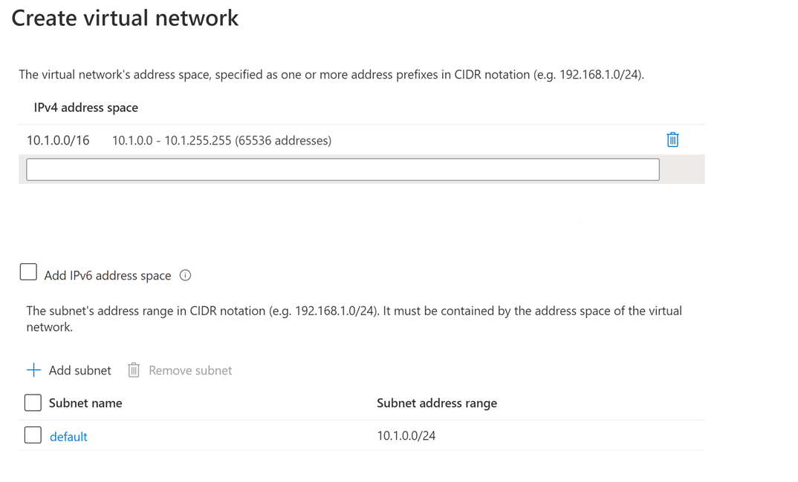

---
wts:
    title: '04 - Membuat jaringan virtual (20 menit)'
    module: 'Modul 02 – Layanan Core Azure (Beban Kerja)'
---
# 04 - Membuat jaringan virtual

Dalam panduan ini, kita akan membuat jaringan virtual, menyebarkan dua komputer virtual ke jaringan virtual tersebut dan kemudian mengizinkan satu komputer virtual untuk melakukan ping ke yang lain di dalam jaringan virtual tersebut.

# Tugas 1: Membuat jaringan virtual (20 menit)

Dalam tugas ini, kita akan membuat jaringan virtual. 

1. Masuk ke portal Microsoft Azure di <a href="https://portal.azure.com" target="_blank"><span style="color: #0066cc;" color="#0066cc">https://portal.azure.com</span></a>

2. Dari bilah **All services**, cari dan pilih **Virtual networks**, lalu klik **+ Add, + Create, atau + New**. 

3. Pada bilah **Create virtual network**, isi informasi berikut (biarkan default untuk yang lainnya):

    | Setting | Value | 
    | --- | --- |
    | Subscription | **Pilih langganan Anda** |
    | Resource group | **myRGVNet** (buat baru) |
    | Name | **vnet1** |
    | Location | **(US) East US** |
    | Address space |**10.1.0.0/16** |
    | Subnet - Name | **default** |
    | Subnet Address range | **10.1.0.0/24** |

    
    

5. Klik tombol **Review + create**. Pastikan validasi lolos.

6. Klik tombol **Create** untuk menyebarkan jaringan virtual. 

    **Catatan**: Dalam organisasi Anda, bagaimana Anda mengetahui jaringan virtual dan alamat IP mana yang Anda perlukan?

# Tugas 2: Membuat dua komputer virtual

Dalam tugas ini, kita akan membuat dua komputer virtual di jaringan virtual. 

1. Dari bilah **All services**, cari **Virtual machines** lalu klik **+ Add** dan pilih **+ Virtual machines**. 

2. Pada tab **Basics**, isi informasi berikut (biarkan default untuk yang lainnya):

   | Setting | Value | 
   | --- | --- |
   | Subscription | **Pilih langganan Anda**  |
   | Resource group |  **myRGVNet** |
   | Virtual machine name | **vm1**|
   | Region | **(US) East US** |
   | Image | **Windows Server 2019 Datacenter** |
   | Username| **azureuser** |
   | Password| **Pa$$w0rd1234** |
   | Public inbound ports| Pilih **Allow selected ports**  |
   | Selected inbound ports| **RDP (3389)** |
   |||

3. Pilih tab **Networking**. Pastikan komputer virtual ditempatkan di jaringan virtual vnet1. Tinjau pengaturan default, tetapi jangan lakukan perubahan apa pun. 

   | Setting | Value | 
   | --- | --- |
   | Virtual network | **vnet1** |
   |||

4. Klik **Review + create**. Setelah Validasi lolos, klik **Create**. Waktu penyebaran dapat berbeda-beda, tetapi biasanya perlu waktu antara tiga hingga enam menit untuk disebarkan.

5. Pantau penyebaran Anda, tetapi lanjutkan ke langkah berikutnya. 

6. Buat komputer virtual kedua dengan mengulangi langkah **2 hingga 4** di atas. Pastikan Anda menggunakan nama komputer virtual yang berbeda, komputer virtual tersebut berada dalam jaringan virtual yang sama, dan menggunakan alamat IP publik yang baru:

    | Setting | Value |
    | --- | --- |
    | Resource group | **myRGVNet** |
    | Virtual machine name |  **vm2** |
    | Virtual network | **vnet1** |
    | Public IP | (baru) **vm2-ip** |
    |||

7. Tunggu hingga kedua komputer virtual disebarkan 

# Tugas 3: Menguji koneksi 

Dalam tugas ini, kami akan mengizinkan upaya masuk ke satu VM dan melakukan ping ke VM lainnya. 

1. Dari bilah **All resource**, cari **vm1**, buka bilah **Overview**, dan pastikan **Status** adalah **Running**. Anda mungkin perlu melakukan **Refresh** halamannya.

2. Di bilah **Overview**, klik tombol **Connect**.

    **Catatan**: Petunjuk berikut memberi tahu Anda cara menyambungkan ke komputer virtual dari komputer Windows. 

3. Di bilah **Connect to virtual machine**, pertahankan opsi default untuk tersambung dengan alamat IP publik melalui port 3389 dan klik **Download RDP File**.

4. Buka file RDP yang diunduh dan klik **Connect** saat diminta. 

5. Di jendela **Windows Security**, ketik nama pengguna **azureuser** dan kata sandi **Pa$$w0rd1234**, lalu klik **OK**.

6. Anda mungkin menerima peringatan sertifikat selama proses masuk. Klik **Yes** atau untuk membuat koneksi dan menyambungkan ke komputer virtual yang Anda sebarkan. Anda akan berhasil tersambung.

7. Buka perintah PowerShell di komputer virtual, dengan mengklik tombol **Start**, mengetikkan **PowerShell**, mengklik kanan **Windows PowerShell** di menu klik kanan, dan klik **Run as administrator**

8. Di Powershell, ketik perintah berikut untuk berupaya berkomunikasi dengan vm2, Anda akan melihat bahwa Anda berhasil.

   ```PowerShell
   ping vm2
   ```

Selamat! Anda telah mengonfigurasi dan menyebarkan dua komputer virtual dalam jaringan virtual. Anda telah menguji bahwa Anda dapat berkomunikasi antara dua komputer virtual. 

**Catatan**: Untuk menghindari biaya tambahan, Anda dapat menghapus grup sumber daya ini. Telusuri grup sumber daya, klik grup sumber daya, lalu klik **Delete resource group**. Pastikan nama grup sumber daya lalu klik **Delete**. Pantau **Notifications** untuk melihat bagaimana proses penghapusan.
