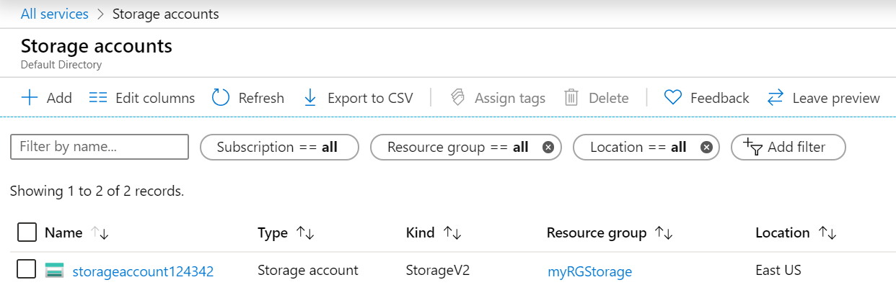

---
wts:
    title: '05 - Membuat penyimpanan blob (5 menit)'
    module: 'Modul 02 – Layanan Core Azure (Beban Kerja)'
---
# 05 - Membuat penyimpanan blob (5 menit)

Dalam panduan ini, kita akan membuat akun penyimpanan, lalu bekerja dengan file penyimpanan blob.

# Tugas 1: Membuat akun penyimpanan 

Dalam tugas ini, kita akan membuat akun penyimpanan baru. 

1. Masuk ke portal Microsoft Azure di <a href="https://portal.azure.com" target="_blank">https://portal.azure.com</a>

2. Dari bilah **All services**, cari dan pilih **Storage accounts**, lalu klik **+ Add, + Create, + New**. 

3. Pada tab **Basics** dari bilah **Create storage account**, isi informasi berikut (ganti **xxxx** pada nama akun penyimpanan dengan huruf dan angka sedemikian rupa sehingga namanya unik secara global). Gunakan pengaturan default untuk yang lainnya.

    | Setting | Value | 
    | --- | --- |
    | Subscription | **Biarkan seperti default yang ada** |
    | Resource group | **Buat nama grup sumber daya baru** |
    | Storage account name | **storageaccountxxxxx** |
    | Location | **(US) East US**  |
    | Performance | **Standard** |
    | Redundancy | **Locally redundant storage (LRS)** |
    
    **Catatan** - Ingatlah untuk mengubah **xxxx** agar menjadi **Nama akun penyimpanan** yang unik

5. Klik **Review + Create** untuk meninjau pengaturan akun penyimpanan Anda dan mengizinkan Azure untuk memvalidasi konfigurasi. 

6. Setelah divalidasi, klik **Create**. Tunggu pemberitahuan bahwa akun berhasil dibuat. 

7. Dari halaman Beranda, cari dan pilih **Storage accounts** dan pastikan akun penyimpanan baru Anda terdaftar.

    

# Tugas 2: Bekerja dengan penyimpanan blob

Dalam tugas ini, kita akan membuat kontainer Blob dan mengunggah file blob. 

1. Klik nama akun penyimpanan baru, gulir ke bagian **Blob service** di menu sebelah kiri, lalu klik **Containers**.

2. Klik **+ Container** dan lengkapi informasinya. Gunakan ikon Informasi untuk mempelajari lebih lanjut. Setelah selesai, klik **Create**.

    | Setting | Value |
    | --- | --- |
    | Name | **container1**  |
    | Public access level| **Private (no anonymous access)** |
  

    

4. Buka jendela browser baru dan cari **Bing** untuk gambar bunga. Klik kanan gambar itu dan simpanlah ke VM Anda. 

6. Kembali ke Portal, klik **container1**, lalu pilih **Upload**.

5. Telusuri gambar file yang baru Anda simpan di komputer lokal Anda. Pilih gambar itu, lalu pilih unggah.

   
6. Klik panah **Advanced**, biarkan nilai default tetapi tinjau opsi yang tersedia, lalu klik **Upload**.

    **Catatan**: Anda dapat mengunggah blob sebanyak yang Anda suka dengan cara ini. Blob baru akan dicantumkan di dalam kontainer.

7. Setelah file diunggah, klik kanan pada file dan perhatikan opsi termasuk Tampilkan/edit, Unduh, Properti, dan Hapus. 

8. Jika Anda punya waktu,tinjau opsi untuk File, Tables, dan Queues.

# Tugas 3: Memantau akun penyimpanan

1. Kembalilah ke bilah akun penyimpanan dan klik **Diagnose and solve problems**. 

2. Jelajahi beberapa masalah penyimpanan paling umum. Perhatikan bahwa ada beberapa pemecah masalah di sini.

3. Di bilah akun penyimpanan, gulir ke bawah ke bagian **Monitoring** dan klik **Insights**. Perhatikan bahwa ada informasi tentang Kegagalan, Performa, Ketersediaan, dan Kapasitas. Informasi Anda akan berbeda.

    

Selamat! Anda telah membuat akun penyimpanan, lalu bekerja dengan blob penyimpanan.

**Catatan**: Untuk menghindari biaya tambahan, Anda dapat secara opsional menghapus grup sumber daya ini. Telusuri grup sumber daya, klik grup sumber daya, lalu klik **Delete resource group**. Verifikasi nama grup sumber daya, lalu klik **Delete**. Pantau **Notifications** untuk melihat bagaimana proses penghapusan.
