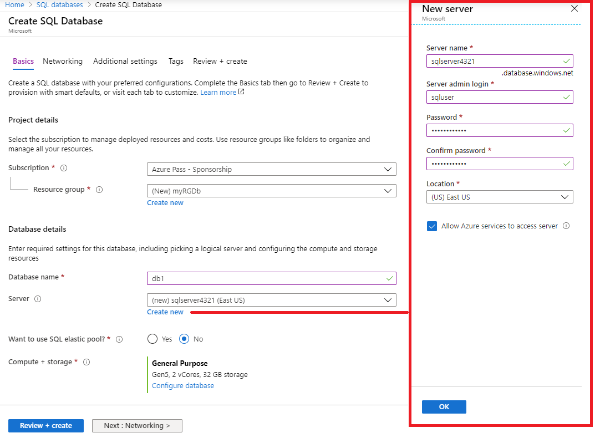
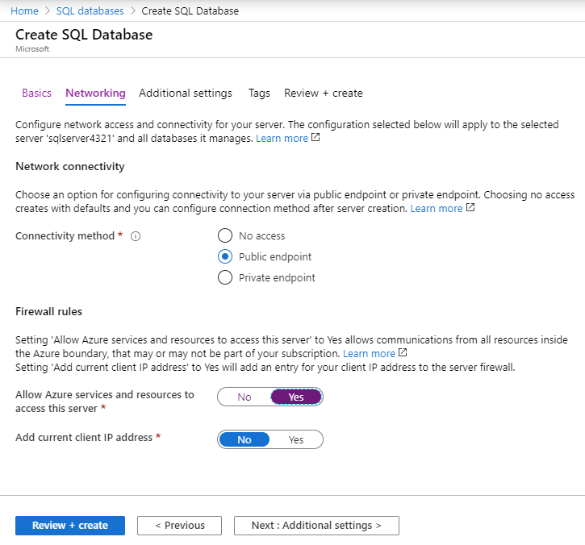
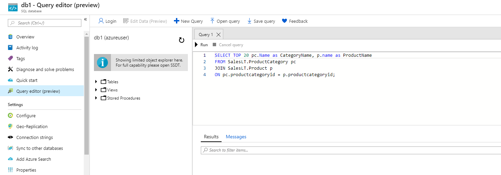

---
wts:
    title: '06 - Membuat database SQL (5 menit)'
    module: 'Modul 02 – Core Azure Services (Beban Kerja)'
---

# 06 - Membuat database SQL

Dalam panduan ini, kita akan membuat database SQL di Azure, lalu melakukan kueri data di database tersebut.

# Tugas 1: Membuat database (5 menit)

Dalam tugas ini, kita akan membuat database SQL berdasarkan database sampel AdventureWorksLT. 

1. Masuk ke portal Microsoft Azure di [**https://portal.azure.com**](https://portal.azure.com).

2. Dari bilah **All services**, cari dan pilih **SQL databases**, lalu klik **+ Add, + Create, atau + New**. 

3. Pada tab **Basics**, isi informasi ini.  

    | Setting | Value | 
    | --- | --- |
    | Subscription | **Pilih langganan Anda** |
    | Resource group | **myRGDb** (buat baru) |
    | Database name| **db1** | 
    | | |

3. Di samping daftar menurun **Server**, klik **Create new** dan masukkan informasi ini (ganti **xxxx** dalam nama server dengan huruf dan angka sehingga namanya unik secara global). Klik **OK** ketika selesai.

    | Setting | Value | 
    | --- | --- |
    | Server name | **sqlserverxxxx** (harus unik) | 
    | Server admin login | **sqluser** |
    | Password | **Pa$$w0rd1234** |
    | Location | **(US) US Timur** |
    | Allow Azure services to access server| ***Pilih kotak centang*** |
    | | |

   

4. Pindah ke tab **Networking** dan konfigurasikan pengaturan berikut (biarkan yang lain dengan nilai default) 

    | Setting | Value | 
    | --- | --- |
    | Connectivity method | **Public endpoint** |    
    | Allow Azure services and resources to access this server | **Yes** |
    | Add current client IP address | **No** |
    | | |
    
   

5. Pindah ke tab **Additional settings**. Kita akan menggunakan database sampel AdventureWorksLT.

    | Setting | Value | 
    | --- | --- |
    | Use existing data | **Sample** |
    | Collation | ***gunakan default*** |
    | Enable Azure Defender for SQL | **Not now** |
    | | |

    

6. Klik **Review + create**, lalu klik **Buat** untuk menyebarkan dan memprovisi grup sumber daya, server, dan database. Ini bisa memakan waktu sekitar 2 hingga 5 menit untuk menyebarkan.

7. Buka tab sumber daya untuk menemukan database SQL yang Anda buat. Anda mungkin perlu untuk memuat ulang.

# Tugas 2: Menguji database.

Dalam tugas ini, kita akan mengonfigurasi server SQL dan menjalankan kueri SQL. 

1. Dari bilah **All services**, cari dan pilih **SQL databases** dan pastikan database baru Anda telah dibuat. Anda mungkin perlu melakukan **Refresh** halamannya.

    

2. Klik entri **db1** yang mewakili database SQL yang Anda buat, lalu klik **Query editor (preview)**.

3. Masuk sebagai **sqluser** dengan kata sandi **Pa$$w0rd1234**.

4. Anda tidak akan bisa masuk. Baca kesalahan dengan cermat dan catat alamat IP yang perlu diizinkan melalui firewall. 

    

5. Dari bilah **db1**, klik **Overview**. 

    

6. Dari bilah **Overview** server SQL, klik **Set server firewall**.

7. Klik **Add client IP** (bilah menu atas) untuk menambahkan alamat IP yang direferensikan dalam kesalahan. Pastikan untuk melakukan **Save** perubahan Anda. 

    

8. Kembali ke database SQL Anda dan halaman masuk **Query Editor (Preview)**. Coba masuk sebagai **sqluser** dengan kata sandi **Pa$$w0rd1234**. Kali ini Anda akan berhasil. Perhatikan bahwa mungkin perlu beberapa menit untuk menyebarkan aturan firewall baru. 

9. Setelah Anda berhasil masuk dan panel kueri muncul, masukkan kueri berikut ke dalam panel editor.

    ```SQL
    SELECT TOP 20 pc.Name as CategoryName, p.name as ProductName
    FROM SalesLT.ProductCategory pc
    JOIN SalesLT.Product p
    ON pc.productcategoryid = p.productcategoryid;
    ```

    

10. Klik **Run**, lalu tinjau hasil kueri di panel **Results**. Kueri akan berjalan dengan sukses.

    

Selamat! Anda telah membuat database SQL di Azure dan berhasil membuat kueri data dalam database tersebut.

**Catatan**: Untuk menghindari biaya tambahan, Anda dapat menghapus grup sumber daya ini. Telusuri grup sumber daya, klik grup sumber daya, lalu klik **Delete resource group**. Pastikan nama grup sumber daya lalu klik **Delete**. Pantau **Notifications** untuk melihat bagaimana proses penghapusan.
