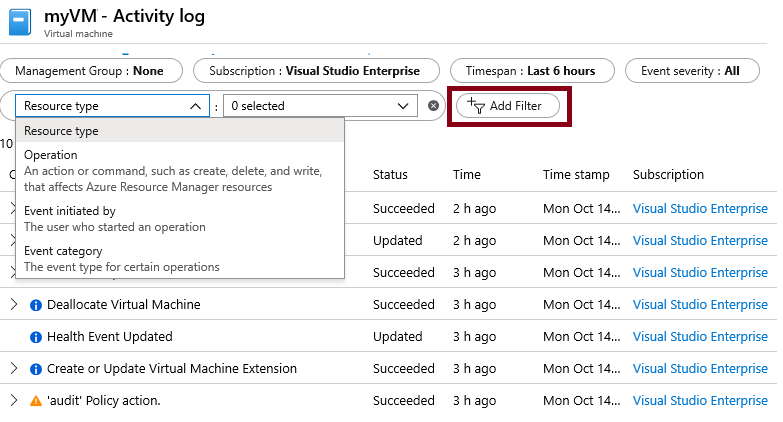

---
wts:
    title: '09 - Membuat komputer virtual dengan Templat (10 mnt)'
    module: 'Modul 03: Menjelaskan solusi inti dan alat manajemen'
---
# 09 - Membuat komputer virtual dengan Templat

Dalam panduan ini, kita akan menyebarkan komputer virtual dengan templat QuickStart dan memeriksa kemampuan pemantauan.

# Tugas 1: Menjelajahi galeri dan menemukan templat (10 mnt)

Dalam tugas ini, kita akan menelusuri galeri Azure QuickStart dan menyebarkan templat yang membuat komputer virtual. 

1. Di browser, akses [galeri Templat Azure QuickStart](https://azure.microsoft.com/resources/templates?azure-portal=true). Di galeri, Anda akan menemukan sejumlah templat populer dan baru-baru ini diperbarui. Templat ini mengotomatiskan penyebaran sumber daya Azure, termasuk penginstalan paket perangkat lunak populer.

2. Telusuri berbagai jenis templat yang tersedia. 

    **Catatan**: Apakah ada templat yang menarik bagi Anda?

3. Cari atau langsung akses templat [Menyebarkan Komputer Virtual ](https://azure.microsoft.com/resources/templates/101-vm-simple-windows?azure-portal=true).

    **Catatan**: Tombol **Deploy to Azure** memungkinkan Anda menerapkan templat melalui portal Microsoft Azure. Selama penyebaran tersebut, Anda hanya akan diminta untuk sejumlah kecil parameter konfigurasi. 

4. Klik tombol **Deploy to Azure**. Sesi browser Anda akan secara otomatis dialihkan ke [portal Microsoft Azure](http://portal.azure.com/).

5. Jika diminta, masuk ke langganan Azure yang ingin Anda gunakan di lab ini.

6. Klik **Edit template**. Format templat Resource Manager menggunakan format JSON. Tinjau parameter dan variabel.  Lalu temukan parameter untuk nama komputer virtual. Ubah nama menjadi **myVMTemplate**. **Simpan** perubahan Anda. Anda dikembalikan ke bilah **Custom deployment** di portal Microsoft Azure.

    

7. Pada bilah **Custom deployment**, konfigurasikan parameter yang diperlukan oleh templat (ganti ***xxxx*** dalam awalan label DNS dengan huruf dan angka sehingga label tersebut unik secara global). Gunakan pengaturan default untuk yang lainnya. 

    | Setting| Value|
    |----|----|
    | Subscription | **Pilih langganan Anda**|
    | Resource group | **myRGTemplate** (buat baru) |
    | Location | **(US) East US** |
    | Admin username | **azureuser** |
    | Admin password | **Pa$$w0rd1234** |
    | DNS label prefix | **myvmtemplate*xxxx*** |
    | Windows OS version | **2019-Datacenter** |
    | | |
    
    **Catatan**: Tidak ada biaya yang terkait dengan templat ini.

8. Klik **Review + Create**.

9. Setelah melewati proses Validasi, klik tombol **Create**. Diperlukan waktu lima hingga tujuh menit untuk menyebarkan komputer virtual. 

# Tugas 2: Memverifikasi dan memantau penyebaran komputer virtual Anda

Dalam tugas ini, kita akan memastikan komputer virtual telah disebarkan dengan benar. 

1. Dari bilah **All services**, cari dan pilih **Virtual machines**.

2. Pastikan komputer virtual baru Anda telah dibuat. 

    

3. Pilih komputer virtual Anda dan di panel **Overview**, gulir ke bawah untuk melihat data pemantauan.

    **Catatan**: Jangka waktu pemantauan dapat disesuaikan mulai dari satu jam hingga 30 hari.

4. Tinjau bagan berbeda yang disediakan termasuk **CPU (average)**, **Network (total)**, dan **Disk bytes (total)**. 

    

5. Klik di bagan mana saja. Perhatikan bahwa Anda dapat **Menambahkan metrik** dan mengubah jenis bagan.

6. Kembali ke bilah **Overview**.

7. Klik **Activity log** (panel sebelah kiri). Log aktivitas merekam peristiwa seperti pembuatan atau pengubahan sumber daya. 

8. Klik **Add filter**, dan lakukan eksperimen dengan menelusuri berbagai jenis dan operasi peristiwa. 

    

**Catatan**: Untuk menghindari biaya tambahan, Anda dapat menghapus grup sumber daya ini. Telusuri grup sumber daya, klik grup sumber daya, lalu klik **Delete resource group**. Pastikan nama grup sumber daya lalu klik **Delete**. Pantau **Notifications** untuk melihat bagaimana proses penghapusan.
