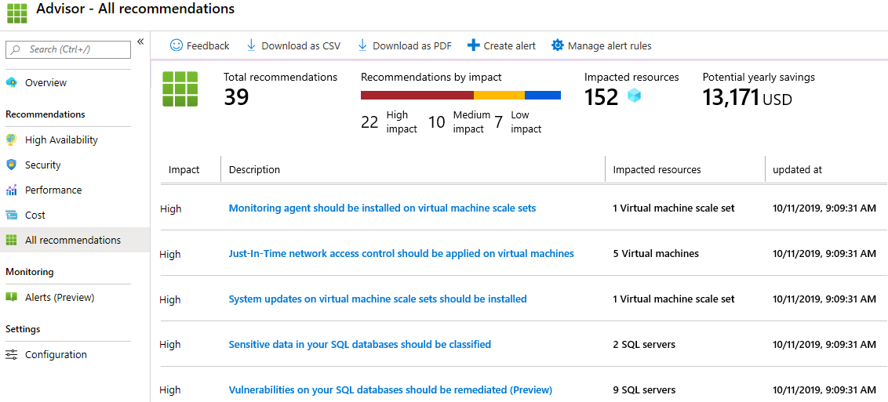

---
wts:
    title: '10 - Membuat komputer virtual dengan PowerShell (10 mnt)'
    module: 'Modul 03: Menjelaskan solusi inti dan alat manajemen'
---
# 10 - Membuat komputer virtual dengan PowerShell

Dalam panduan ini, kita akan mengonfigurasi Cloud Shell, menggunakan modul Azure PowerShell untuk membuat grup sumber daya dan komputer virtual, serta meninjau rekomendasi Azure Advisor. 

# Tugas 1: Mengonfigurasi Cloud Shell (10 mnt)

Dalam tugas ini, kita akan mengonfigurasi Cloud Shell. 

1. Masuk ke [portal Microsoft Azure](https://portal.azure.com).

2. Dari portal Microsoft Azure, buka **Azure Cloud Shell** dengan mengklik ikon di sebelah kanan atas Portal Microsoft Azure.

    

3. Jika sebelumnya Anda sudah pernah menggunakan Cloud Shell, lanjutkan ke tugas berikutnya. 

4. Saat diminta untuk memilih **Bash** atau **PowerShell**, pilih **PowerShell**.

5. Saat diminta, klik **Create storage**, dan tunggu hingga Azure Cloud Shell dimulai. 

# Tugas 2: Membuat grup sumber daya dan komputer virtual

Dalam tugas ini, kita akan menggunakan PowerShell untuk membuat grup sumber daya dan komputer virtual.  

1. Pastikan **PowerShell** dipilih di menu menurun di sebelah kiri atas panel Cloud Shell.

2. Pada sesi PowerShell, di dalam panel Cloud Shell, buat grup sumber daya baru. 

    ```PowerShell
    New-AzResourceGroup -Name myRGPS -Location EastUS
    ```

3. Pastikan grup sumber daya baru Anda. 

    ```PowerShell
    Get-AzResourceGroup | Format-Table
    ```

4. Buat komputer virtual. Saat diminta, berikan nama pengguna (**azureuser**) dan kata sandi (**Pa$$w0rd1234**) yang akan dikonfigurasi sebagai akun Administrator lokal di komputer virtual tersebut. Pastikan Anda menyertakan karakter centang (`) di akhir setiap baris kecuali yang terakhir (tidak boleh ada karakter centang jika Anda mengetik seluruh perintah pada satu baris).

    ```PowerShell
    New-AzVm `
    -ResourceGroupName "myRGPS" `
    -Name "myVMPS" `
    -Location "East US" `
    -VirtualNetworkName "myVnetPS" `
    -SubnetName "mySubnetPS" `
    -SecurityGroupName "myNSGPS" `
    -PublicIpAddressName "myPublicIpPS"
    ```
** Tunggu hingga komputer virtual disebarkan sebelum menutup PowerShell

5. Tutup panel Cloud Shell sesi PowerShell.

6. Di portal Microsoft Azure, cari **Virtual machines** dan pastikan bahwa **myVMPS** sedang berjalan. Ini mungkin membutuhkan waktu beberapa menit.

    

7. Akses komputer virtual baru dan tinjau pengaturan Overview dan Networking untuk memastikan bahwa informasi Anda telah disebarkan dengan benar. 

# Tugas 3: Menjalankan perintah di Cloud Shell

Dalam tugas ini, kita akan berlatih menjalankan perintah PowerShell dari Cloud Shell. 

1. Dari portal Microsoft Azure, buka **Azure Cloud Shell** dengan mengklik ikon di kanan atas Portal Microsoft Azure.

2. Pastikan **PowerShell** dipilih di menu menurun di sebelah kiri atas panel Cloud Shell.

3. Ambil informasi tentang komputer virtual Anda termasuk nama, grup sumber daya, lokasi, dan status. Perhatikan PowerState sedang **berjalan**.

    ```PowerShell
    Get-AzVM -name myVMPS -status | Format-Table -autosize
    ```

4. Hentikan komputer virtual. Ketika diminta, konfirmasi (Yes) untuk tindakan tersebut. 

    ```PowerShell
    Stop-AzVM -ResourceGroupName myRGPS -Name myVMPS
    ```

5. Pastikan status komputer virtual Anda. PowerState sekarang semestinya **dibatalkan alokasinya**. Anda juga dapat memastikan status komputer virtual di portal. 

    ```PowerShell
    Get-AzVM -name myVMPS -status | Format-Table -autosize
    ```

# Tugas 4: Meninjau Rekomendasi Azure Advisor

**Catatan:** Tugas yang sama ini ada di lab Membuat VM dengan Azure CLI. 

Dalam tugas ini, kita akan meninjau rekomendasi Azure Advisor untuk komputer virtual. 

1. Dari bilah **All services**, cari dan pilih **Advisor**. 

2. Di bilah **Advisor**, pilih **Overview**. Rekomendasi pemberitahuan dikelompokkan berdasarkan Ketersediaan Tinggi, Keamanan, Performa, dan Biaya. 

    

3. Pilih **All recommendations** dan luangkan waktu untuk melihat setiap rekomendasi dan tindakan yang disarankan. 

    **Catatan:** Bergantung pada sumber daya Anda, rekomendasinya akan berbeda. 

    

4. Perhatikan bahwa Anda dapat mengunduh rekomendasi sebagai file CSV atau PDF. 

5. Perhatikan bahwa Anda dapat membuat peringatan. 

6. Jika Anda memiliki waktu, lanjutkan bereksperimen dengan Azure PowerShell. 

Selamat! Anda telah mengonfigurasi Cloud Shell, membuat komputer virtual menggunakan PowerShell, berlatih dengan perintah PowerShell, dan melihat rekomendasi Advisor.

**Catatan**: Untuk menghindari biaya tambahan, Anda dapat menghapus grup sumber daya ini. Telusuri grup sumber daya, klik grup sumber daya, lalu klik **Delete resource group**. Verifikasi nama grup sumber daya lalu klik **Delete**. Pantau **Notifications** untuk melihat bagaimana proses penghapusan.
