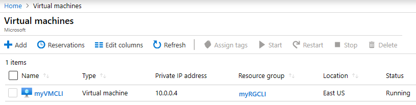

---
wts:
    title: '11 - Membuat komputer virtual dengan CLI (10 mnt)'
    module: 'Modul 03: Menjelaskan solusi inti dan alat manajemen'
---
# 11 - Membuat VM dengan CLI (10 mnt)

Dalam panduan ini, kita akan mengonfigurasi Cloud Shell, menggunakan modul Azure CLI untuk membuat grup sumber daya dan komputer virtual, serta meninjau rekomendasi Azure Advisor. 

# Tugas 1: Mengonfigurasi Cloud Shell 

Dalam tugas ini, kita akan menggunakan Cloud Shell., lalu Azure CLI untuk membuat grup sumber daya dan komputer virtual.  

1. Masuk ke [portal Microsoft Azure](https://portal.azure.com).

2. Dari portal Microsoft Azure, buka **Azure Cloud Shell** dengan mengklik ikon di kanan atas Portal Microsoft Azure.

    
   
3. Di dialog Selamat Datang ke Azure Cloud Shell, jika diminta untuk memilih **Bash** atau **PowerShell**, pilih **Bash**. 

4. Jendela baru akan terbuka yang menyatakan **Anda tidak memiliki penyimpanan yang dimuat**. Pilih **advanced settings**.

5. Di layar pengaturan lanjutan, isi bidang berikut, lalu klik Buat Penyimpanan.
    - Resource Group **Buat nama grup sumber daya baru**
    - Storage Account: Buat akun baru menggunakan nama yang unik secara global (mis. cloudshellxyzstorage)
    - File Share: Buat yang baru dan beri nama cloudshellfileshare


# Tugas 2: Menggunakan CLI untuk membuat komputer virtual.

Dalam tugas ini, kita akan menggunakan Azure CLI untuk membuat grup sumber daya dan komputer virtual.

1. Pastikan **Bash** dipilih di menu menurun di sebelah kiri atas panel Cloud Shell (dan jika belum dipilih, pilihlah).

    


2. Verifikasi grup sumber daya yang Anda gunakan dengan memasukkan perintah berikut.

    ```cli
    az group list --output table
    ```

4. Di Cloud Shell, masukkan perintah di bawah dan pastikan bahwa setiap baris, kecuali yang terakhir, diikuti oleh karakter garis miring terbalik (`\`). Jika Anda mengetik seluruh perintah pada baris yang sama, jangan gunakan karakter garis miring terbalik apa pun. 

    ```cli
    az vm create \
    --name myVMCLI \
    --resource-group myRGCLI \
    --image UbuntuLTS \
    --location EastUS2 \
    --admin-username azureuser \
    --admin-password Pa$$w0rd1234
    ```

    >**Catatan**: Jika Anda menggunakan baris perintah di komputer Windows, ganti karakter garis miring terbalik (`\`) dengan karakter tanda sisipan (`^`).

    **Catatan**: Perintah ini akan memerlukan waktu 2 hingga 3 menit hingga selesai. Perintah tersebut akan membuat komputer virtual dan berbagai sumber daya yang terkait dengan perintah seperti penyimpanan, jaringan, dan sumber daya keamanan. Jangan lanjutkan ke langkah berikutnya hingga penyebaran komputer virtual selesai. 

5. Saat perintah selesai dijalankan, di jendela browser, tutup panel Cloud Shell.

6. Di portal Microsoft Azure, cari **Virtual machines** dan pastikan bahwa **myVMCLI** sedang berjalan.

    


# Tugas 3: Menjalankan perintah di Cloud Shell

Dalam tugas ini, kita akan berlatih menjalankan perintah CLI dari Cloud Shell. 

1. Dari portal Microsoft Azure, buka **Azure Cloud Shell** dengan mengklik ikon di sebelah kanan atas Portal Microsoft Azure.

2. Pastikan **Bash** dipilih di menu menurun di sebelah kiri atas panel Cloud Shell.

3. Ambil informasi tentang komputer virtual yang Anda sediakan, termasuk nama, grup sumber daya, lokasi, dan status. Perhatikan PowerState sedang **berjalan**.

    ```cli
    az vm show --resource-group myRGCLI --name myVMCLI --show-details --output table 
    ```

4. Hentikan komputer virtual. Perhatikan pesan bahwa penagihan berlanjut hingga komputer virtual dibatalkan alokasinya. 

    ```cli
    az vm stop --resource-group myRGCLI --name myVMCLI
    ```

5. Pastikan status komputer virtual. PowerState sekarang semestinya **dihentikan**.

    ```cli
    az vm show --resource-group myRGCLI --name myVMCLI --show-details --output table 
    ```

# Tugas 4: Meninjau Rekomendasi Azure Advisor

Dalam tugas ini, kita akan meninjau rekomendasi Azure Advisor.

   **Catatan:** Jika Anda sudah menyelesaikan lab sebelumnya (Membuat komputer virtual dengan PowerShell), Anda telah melakukan tugas ini. 

1. Dari bilah **All services**, cari dan pilih **Advisor**. 

2. Di bilah **Advisor**, pilih **Overview**. Rekomendasi pemberitahuan dikelompokkan berdasarkan Keandalan, Keamanan, Performa, dan Biaya. 

    

3. Pilih **All recommendations** dan luangkan waktu untuk melihat setiap rekomendasi dan tindakan yang disarankan. 

    **Catatan:** Bergantung pada sumber daya, rekomendasi Anda akan berbeda. 

    

4. Perhatikan bahwa Anda dapat mengunduh rekomendasi sebagai file CSV atau PDF. 

5. Perhatikan bahwa Anda dapat membuat peringatan. 

6. Jika Anda memiliki waktu, lanjutkan bereksperimen dengan Azure CLI. 

Selamat! Anda telah mengonfigurasi Cloud Shell, membuat komputer virtual menggunakan Azure CLI, berlatih dengan perintah Azure CLI, dan melihat rekomendasi Advisor.

**Catatan**: Untuk menghindari biaya tambahan, Anda dapat secara opsional menghapus grup sumber daya ini. Telusuri grup sumber daya, klik grup sumber daya, lalu klik **Delete resource group**. Verifikasi nama grup sumber daya, lalu klik **Delete**. Pantau **Notifications** untuk melihat bagaimana proses penghapusan.
