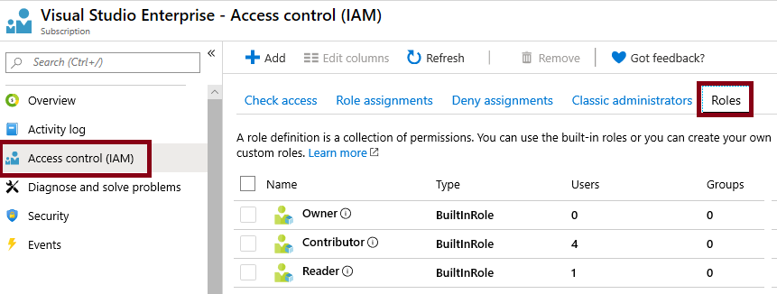
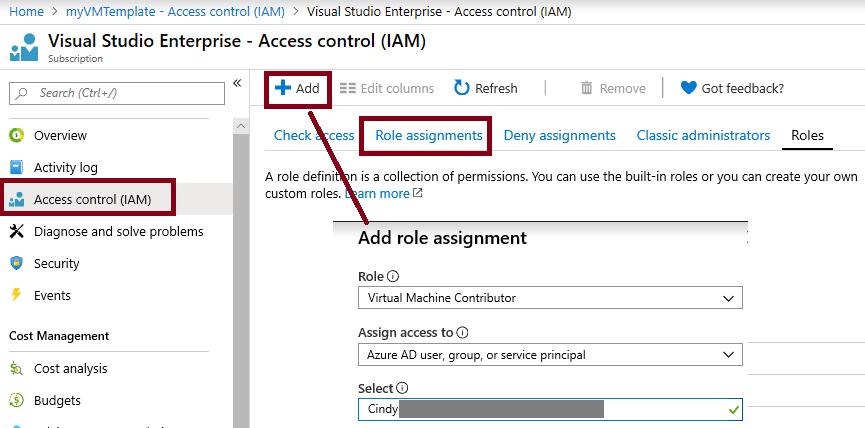

---
wts:
    title: '14 - Mengelola akses dengan RBAC (5 menit)'
    module: 'Modul 05: Mendeskripsikan fitur identitas, tata kelola, privasi, dan kepatuhan'
---
# 14 - Mengelola akses dengan RBAC

Dalam panduan ini, kita akan menetapkan peran dan menampilkan log aktivitas. 

# Tugas 1: Menampilkan dan menetapkan peran (5 menit)

Dalam tugas ini, kita akan menetapkan peran Kontributor komputer virtual. 

1. Masuk ke [portal Microsoft Azure](https://portal.azure.com).

2. Dari bilah **All services**, cari dan pilih **Resource groups**, lalu klik **+ Add, + Create, atau + New**.

3. Buat grup sumber daya baru. Klik **Create** setelah Anda selesai. 

    | Setting | Value |
    | -- | -- |
    | Subscription | **Pilih langganan Anda** |
    | Resource group | **myRGRBAC** |
    | Region | **(US) East US** |
    | | |

4. Buat **Review + create**, lalu klk **Create**.

5. **Refresh** halaman grup sumber daya dan klik entri yang mewakili grup sumber daya yang baru dibuat.

6. Klik bilah **Access control (IAM)**, lalu alihkan ke tab **Roles**. Gulir melalui sejumlah besar definisi peran yang tersedia. Gunakan ikon Informasi untuk mendapatkan ide tentang izin setiap peran. Perhatikan juga informasi tentang jumlah pengguna dan grup yang ditetapkan ke setiap peran.

    

7. Beralih ke tab **Role assignments** pada bilah **myRGRBAC - Access control (IAM)**, klik **+ Add**, lalu klik **Add role assignment**. Tetapkan peran Kontributor Komputer Virtual ke akun pengguna Anda, lalu klik **Save**. 

    | Setting | Value |
    | -- | -- |
    | Role | **Virtual machine contributor** |
    | Assign access to | **user, group, or service principal** |
    | Select | akun pengguna Anda |
    | | |

    **Catatan:** Peran Kontributor komputer virtual memungkinkan Anda mengelola komputer virtual, tetapi tidak mengakses sistem operasinya atau mengelola jaringan virtual dan akun penyimpanan tempat itu tersambung.

    

8. **Refresh** halaman Penetapan peran dan pastikan Anda sekarang terdaftar sebagai Kontributor komputer virtual. 

    **Catatan**: Penugasan ini ini sebenarnya tidak memberikan hak istimewa tambahan apa pun, karena akun Anda sudah memiliki peran Pemilik, yang mencakup semua hak istimewa yang terkait dengan peran Kontributor.

# Tugas 2: Memantau penetapan peran dan menghapus peran

Dalam tugas ini, kita akan menampilkan log aktivitas untuk memverifikasi penetapan peran, lalu menghapus peran tersebut. 

1. Pada bilah grup sumber daya myRGRBAC, klik **Activity log**.

2. Klik **Add filter**, pilih **Operation**, lalu **Create role assignment**.

    

3. Periksa bahwa Log aktivitas menunjukkan penetapan peran Anda. 

    **Catatan**: Dapatkah Anda mengetahui cara menghapus penetapan peran Anda?

Selamat! Anda telah menetapkan peran dan menampilkan log aktivitas. 

**Catatan**: Untuk menghindari biaya tambahan, Anda dapat menghapus grup sumber daya ini. Telusuri grup sumber daya, klik grup sumber daya, lalu klik **Delete resource group**. Pastikan nama grup sumber daya lalu klik **Delete**. Pantau **Notifications** untuk melihat bagaimana proses penghapusan.

