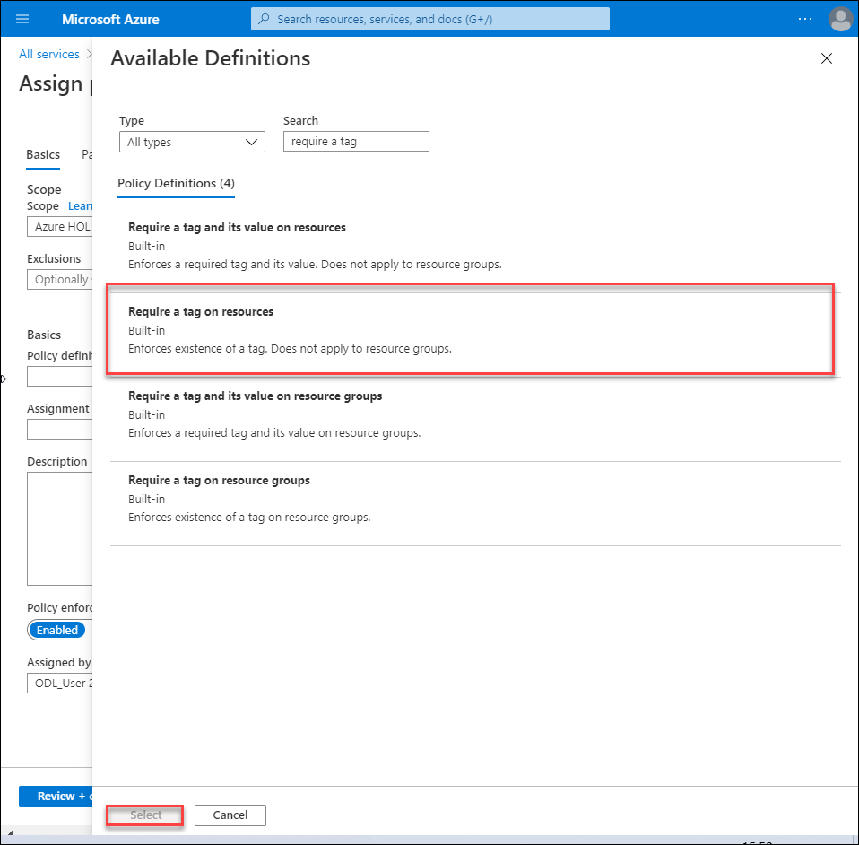
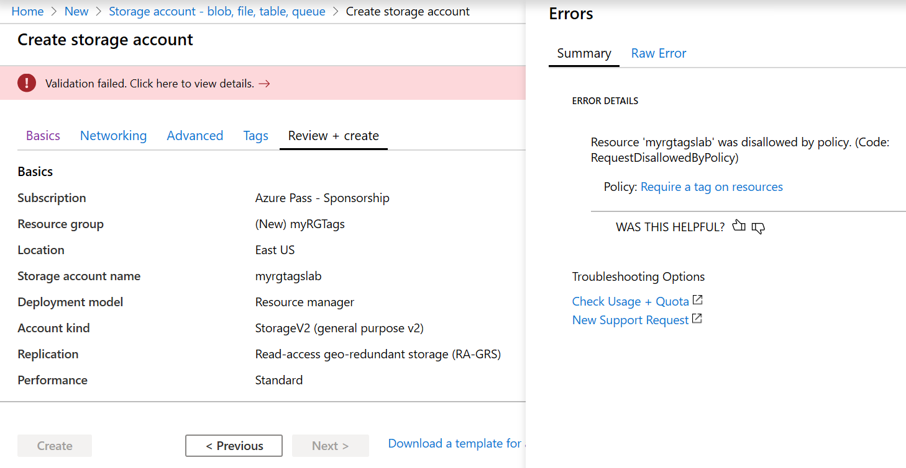
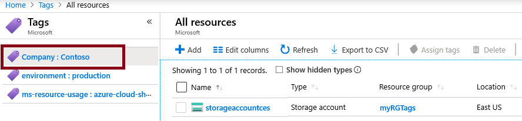

---
wts:
    title: '16 - Menerapkan pemberian tag sumber daya (5 menit)'
    module: 'Modul 05: Mendeskripsikan fitur identitas, tata kelola, privasi, dan kepatuhan'
---
# 16 - Menerapkan pemberian tag sumber daya (5 menit)

Dalam panduan ini, kita akan membuat penugasan kebijakan yang memerlukan pemberian tag, membuat akun penyimpanan dan menguji pemberian tag, menampilkan sumber daya dengan tag tertentu, dan menghapus kebijakan pemberian tag.

# Tugas 1: Membuat penetapan Kebijakan 

Dalam tugas ini, kita akan mengonfigurasi kebijakan **Membutuhkan tag pada sumber daya** dan menetapkannya ke langganan kita. 

1. Masuk ke [portal Microsoft Azure](https://portal.azure.com).

2. Dari bilah **All services**, cari dan pilih **Policy**.

3. Gulir ke bawah ke bagian **Authoring**, klik **Assignments**, lalu klik **Assign Policy** di bagian atas halaman.

4. Perhatikan **Cakupan** untuk kebijakan akan menjadi langganan yang luas. 

5. Di bawah **Basics**, pilih tombol elipsis **Policy definition** (sisi kanan kotak teks). Di kotak **Search**, masukkan **tag** nilai. Daftar Kebijakan yang terkait dengan **tag** kata akan muncul. Gulir ke bawah hingga Anda menemukan definisi **Require a tag on resources**, klik di atasnya dan klik **Select**.

   
   
6.  Di tab **Parameters**, ketikkan **Company : Contoso** untuk nama pasangan kunci/nilai. Klik **Review + create**, lalu klk **Create**.

    

7. Penugasan kebijakan **Memerlukan tag pada sumber daya** sekarang diterapkan. Saat sumber daya dibuat, sumber daya harus menyertakan tag dengan kunci Company : Contoso.
   **Catatan - Anda harus menunggu 30 menit hingga Kebijakan selesai diterapkan.** 

   

# Tugas 2: Membuat akun penyimpanan untuk menguji pemberian tag yang diperlukan.

Dalam tugas ini, kita akan membuat akun penyimpanan untuk menguji pemberian tag yang diperlukan. 

1. Di Portal Microsoft Azure, dari bilah **All services**, cari dan pilih **Storage accounts**, lalu klik **+Add +New +Create**.

2. Pada tab **Basics** bilah **Create storage account**, isi informasi berikut (ganti **xxxx** pada nama akun penyimpanan dengan huruf dan angka sedemikian rupa sehingga namanya unik secara global). Gunakan pengaturan default untuk yang lainnya.

    | Setting | Value | 
    | --- | --- |
    | Subscription | **Gunakan default yang tersedia** |
    | Resource group | **Buat nama grup sumber daya baru** |
    | Storage account name | **storageaccountxxxx** |
    | Location | **(US) East US** |

3. Klik **Review + create**. 

    **Catatan:** Kita sedang menguji untuk melihat apa yang terjadi jika tag tidak diberikan. Harap diperhatikan, mungkin perlu waktu hingga 30 menit agar Kebijakan diterapkan.

4. Anda akan menerima pesan Validasi gagal. Klik pesan **Click here to view details**. Di bilah **Errors** pada tab **Summary**, perhatikan pesan kesalahan yang menyatakan bahwa sumber daya tidak diizinkan oleh Kebijakan.

    **Catatan:** Jika Anda melihat tab Raw Error, Anda akan melihat nama tag spesifik yang diperlukan. 

    

5. Tutup panel **Error** dan klik **Previous** (bagian bawah layar). Berikan informasi pemberian tag. 

    | Setting | Value | 
    | --- | --- |
    | Tag name | **Company:Contoso** (mungkin tidak ada dalam daftar tarik-turun) |

6. Klik **Review + create.** dan periksa bahwa validasi berhasil. Klik **Create** untuk menyebarkan akun penyimpanan. 

# Tugas 3: Menampilkan semua sumber daya dengan tag tertentu.

1. Di Portal Microsoft Azure, dari bilah **All services**, cari dan pilih **Tags**.

2. Catat semua tag dan nilainya. Klik **Company:** Pasangan kunci/nilai **Contoso**. Ini akan menampilkan bilah yang menunjukkan akun penyimpanan yang baru dibuat, selama Anda menyertakan tag selama penyebarannya. 

   

3. Di Portal, tampilkan bilah **All resources**.

4. Klik **Add filter** dan tambahkan kunci tag **Company** sebagai kategori filter. Dengan filter diterapkan, hanya akun penyimpanan Anda yang akan dicantumkan.

    

# Tugas 4: Menghapus penugasan kebijakan.

Dalam tugas ini, kita akan menghapus kebijakan **Membutuhkan tag pada sumber daya** sehingga tidak memengaruhi pekerjaan kita di masa depan. 

1. Di Portal Microsoft Azure, dari bilah **All services**, cari dan pilih **Policy**.

2. Klik entri kebijakan **Require a tag on resources**.

3. Klik **Delete Assignment** di menu bagian atas.

4. Konfirmasikan bahwa Anda ingin menghapus penetapan kebijakan di dialog **Delete assignment** dengan mengklik **Yes**

5. Jika Anda punya waktu, buat sumber daya lain tanpa tag untuk memastikan kebijakan tidak lagi berlaku.

Selamat! Dalam panduan ini, kita telah membuat penetapan kebijakan yang memerlukan pemberian tag, membuat sumber daya (akun penyimpanan), dan menguji pemberian tag, menampilkan sumber daya dengan tag tertentu, serta menghapus kebijakan pemberian tag.

**Catatan**: Untuk menghindari biaya tambahan, Anda dapat secara opsional menghapus grup sumber daya ini. Telusuri grup sumber daya, klik grup sumber daya, lalu klik **Delete resource group**. Verifikasi nama grup sumber daya, lalu klik **Delete**. Pantau **Notifications** untuk melihat bagaimana proses penghapusan.
